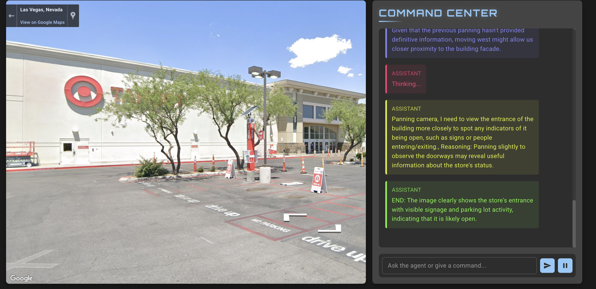

# StreeView Agent - Interactive Street View Navigator

An interactive web application that combines Google Street View navigation with an AI-powered chat interface, allowing users to explore locations through natural language commands.

## Features

- 🗺️ Interactive Google Maps and Street View integration
- 🤖 AI-powered navigation assistant
- 💬 Real-time WebSocket communication
- 📸 Street View snapshot capabilities
- 🛠️ Dynamic camera control (pan, navigate)
- 🌍 Satellite view support

## Tech Stack

### Frontend
- React
- Material-UI (MUI)
- Google Maps JavaScript API
- WebSocket client

### Backend
- FastAPI
- WebSocket server
- LLM integration for AI chat capabilities

## Prerequisites

- Python 3.8+
- Node.js and npm
- Google Maps API key
- LLM API credentials (based on your configuration)

## Demo

